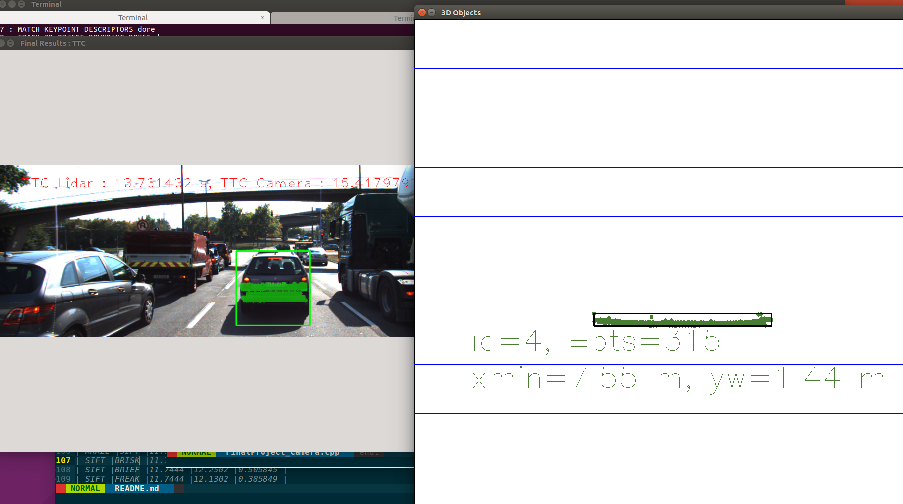
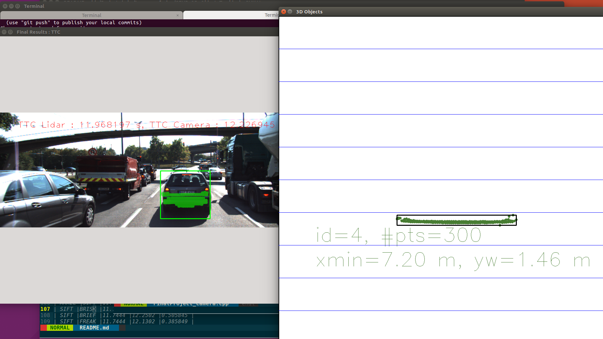

# SFND 3D Object Tracking

Welcome to the final project of the camera course. By completing all the lessons, you now have a solid understanding of keypoint detectors, descriptors, and methods to match them between successive images. Also, you know how to detect objects in an image using the YOLO deep-learning framework. And finally, you know how to associate regions in a camera image with Lidar points in 3D space. Let's take a look at our program schematic to see what we already have accomplished and what's still missing.


In this final project, you will implement the missing parts in the schematic. To do this, you will complete four major tasks: 
1. First, you will develop a way to match 3D objects over time by using keypoint correspondences. 
2. Second, you will compute the TTC based on Lidar measurements. 
3. You will then proceed to do the same using the camera, which requires to first associate keypoint matches to regions of interest and then to compute the TTC based on those matches. 
4. And lastly, you will conduct various tests with the framework. Your goal is to identify the most suitable detector/descriptor combination for TTC estimation and also to search for problems that can lead to faulty measurements by the camera or Lidar sensor. In the last course of this Nanodegree, you will learn about the Kalman filter, which is a great way to combine the two independent TTC measurements into an improved version which is much more reliable than a single sensor alone can be. But before we think about such things, let us focus on your final project in the camera course. 

## Dependencies for Running Locally
* cmake >= 2.8
  * All OSes: [click here for installation instructions](https://cmake.org/install/)
* make >= 4.1 (Linux, Mac), 3.81 (Windows)
  * Linux: make is installed by default on most Linux distros
  * Mac: [install Xcode command line tools to get make](https://developer.apple.com/xcode/features/)
  * Windows: [Click here for installation instructions](http://gnuwin32.sourceforge.net/packages/make.htm)
* Git LFS
  * Weight files are handled using [LFS](https://git-lfs.github.com/)
* OpenCV >= 4.1
  * This must be compiled from source using the `-D OPENCV_ENABLE_NONFREE=ON` cmake flag for testing the SIFT and SURF detectors.
  * The OpenCV 4.1.0 source code can be found [here](https://github.com/opencv/opencv/tree/4.1.0)
* gcc/g++ >= 5.4
  * Linux: gcc / g++ is installed by default on most Linux distros
  * Mac: same deal as make - [install Xcode command line tools](https://developer.apple.com/xcode/features/)
  * Windows: recommend using [MinGW](http://www.mingw.org/)

## Basic Build Instructions

1. Clone this repo.
2. Make a build directory in the top level project directory: `mkdir build && cd build`
3. Compile: `cmake .. && make`
4. Run it: `./3D_object_tracking`.

## Writeup, Task FP.0

### FP.1 Match 3D objects
_Lines 216-244 in camFusion_Student.cpp_ 
I used a cv::Mat to count the occurences of each pair of bounding box IDs.
I then counted the keypoint correspondences per box pair to determine the best matches between frames.
```
// Count the greatest number of matches for each row of cv::Mat aross each column, where each element is {key=currBoxID, val=prevBoxID}
```

### FP.2 Compute lidar-based TTC
_Lines 198-213 in camFusion_Student.cpp_  
In each frame, I took the mean x-distance to reduce the impact of outlier lidar points on my TTC estimate. With the constant velocity model, the key equation is as follows.
```
TTC = d1 * (1.0 / frameRate) / (d0 - d1);
```

### FP.3 Associate keypoint matches with bounding boxes
_Lines 134-154 in camFusion_Student.cpp_  
This function is called for each bounding box, and it loops through every matched keypoint pair in an image. If the keypoint falls within the bounding box region-of-interest (ROI) in the current frame, the keypoint match is associated with the current `BoundingBox` data structure. I use average matched euclidean distance as threshold to remove
some outlier matches.

### FP.4 Compute mono camera-based TTC
_Lines 158-195 in camFusion_Student.cpp_  
The code for this function `computeTTCCamera` draws heavily on the example provided in an earlier lesson. It uses distance ratios on keypoints matched between frames to determine the rate of scale change within an image. This rate of scale change can be used to estimate the TTC.
```
TTC = (-1.0 / frameRate) / (1 - medianDistRatio);
```
This function uses the median distance ratio to avoid the impact of outliers. Unfortunately this approach is still **vulnerable to wild miscalculations** (-inf, NaN, etc.) if there are too many mismatched keypoints. Note also that this algorithm calculates the Euclidean distance for every paired combination of keypoints within the bounding box, `O(n^2)` on the number of keypoints.

### FP.5 Performance evaluation, lidar outliers
I see some outliers affect the value of mean x-distance so that the ttc diff between lidar and camera is relatively large.

_Figure 1, example 1_ 


_Figure 2, example 2_


### FP.6 Performance evaluation, detector/descriptor combinations
I calculate avergae TTC difference across all frames for each combination of detector and descriptors.
AKAZE + FREAK has the best TTC difference.

| Detector |Descriptor |TTC lidar |TTC camera |TTC difference |
|:---:|:----:|:-----:|:-----:|:-----:|
| SHITOMASI |BRISK |11.7444 |11.8711 |0.126762 |
| SHITOMASI |BRIEF |11.7444 |11.9712 |0.226793 |
| SHITOMASI |ORB |11.7444 |12.0483 |0.303979 |
| SHITOMASI |FREAK |11.7444 |11.8358 |0.0914369 |
| SHITOMASI |SIFT |11.7444 |12.0657 |0.321296 |
| HARRIS |BRISK |11.7444 |nan |nan |
| HARRIS |BRIEF |11.7444 |nan |nan |
| HARRIS |ORB |11.7444 |-inf |-inf |
| HARRIS |FREAK |11.7444 |nan |nan |
| HARRIS |SIFT |11.7444 |nan |nan |
| FAST |BRISK |11.7444 |12.0381 |0.293779 |
| FAST |BRIEF |11.7444 |11.9968 |0.252409 |
| FAST |ORB |11.7444 |12.0609 |0.316544 |
| FAST |FREAK |11.7444 |11.949 |0.204593 |
| FAST |SIFT |11.7444 |12.4948 |0.750404 |
| BRISK |BRISK |11.7444 |14.346 |2.60169 |
| BRISK |BRIEF |11.7444 |13.6234 |1.87899 |
| BRISK |ORB |11.7444 |14.1106 |2.36621 |
| BRISK |FREAK |11.7444 |13.6095 |1.86515 |
| BRISK |SIFT |11.7444 |14.2171 |2.47275 |
| ORB |BRISK |11.7444 |-inf |-inf |
| ORB |BRIEF |11.7444 |-inf |-inf |
| ORB |ORB |11.7444 |-inf |-inf |
| ORB |FREAK |11.7444 |-inf |-inf |
| ORB |SIFT |11.7444 |-inf |-inf |
| AKAZE |BRISK |11.7444 |12.0046 |0.260278 |
| AKAZE |BRIEF |11.7444 |11.8213 |0.0769031 |
| AKAZE |ORB |11.7444 |11.9512 |0.206828 |
| AKAZE |FREAK |11.7444 |11.8175 |0.073115 |
| AKAZE |AKAZE |11.7444 |12.4612 |0.716884 |
| AKAZE |SIFT |11.7444 |12.0617 |0.317365 |
| SIFT |BRISK |11.7444 |12.3305 |0.586157 |
| SIFT |BRIEF |11.7444 |12.2502 |0.505845 |
| SIFT |FREAK |11.7444 |12.1302 |0.385849 |
| SIFT |SIFT |11.7444 |11.6081 |-0.136261 |

Certain detector/descriptor combinations, especially the `Harris` and `ORB` detectors, produced very unreliable camera TTC estimates.
